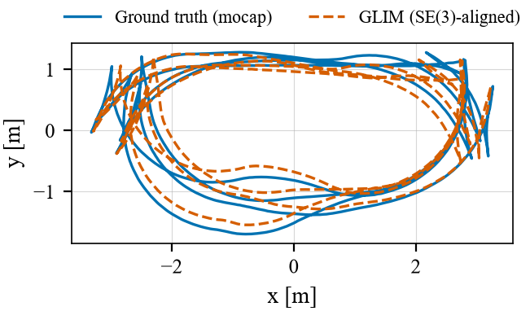
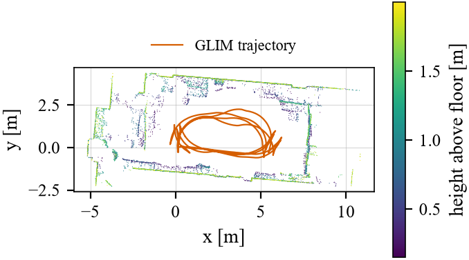
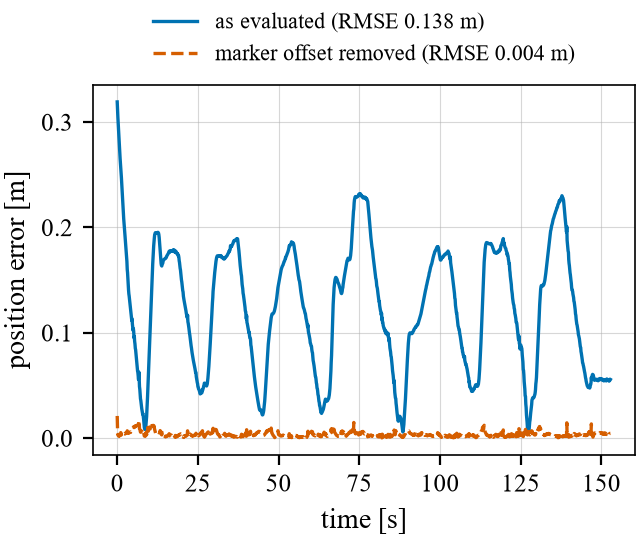
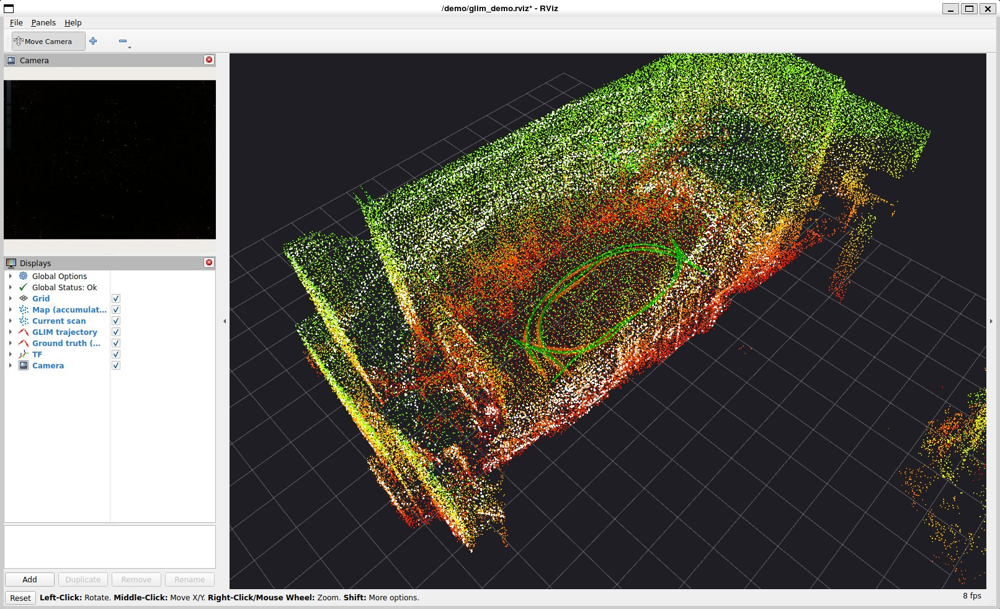
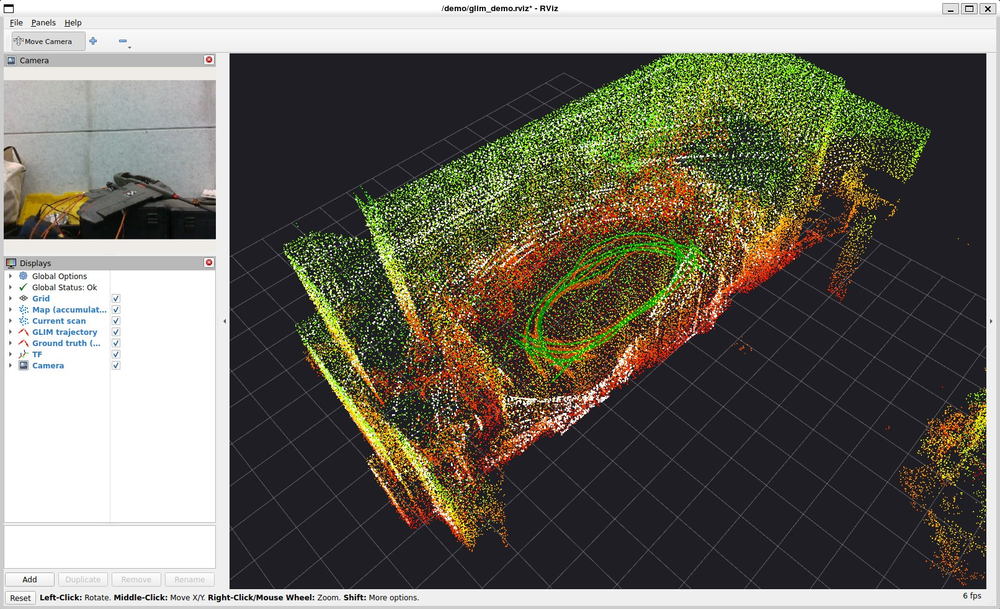

# GLIM: status report after lab session 1

Philip Stix · branch `philip-glim` · 2026-10-08

## Summary

- GLIM runs end to end on M3DGR: M3DGR bag → converter → GLIM (Docker, GPU) → `trajectory_tum.txt` + `map.ply` → `pipeline.evaluate`.
  The lab 1 goal (play the dataset back in ROS and show it in RViz) is done; see [Live demo](#live-demo-rviz).
- **Varying-illu01, 5/5 runs successful.** ATE RMSE (SE(3)) median **0.138 m**, IQR 0.09 mm. The runs are practically deterministic.
- **Most of this error is not GLIM's error.** The Sim(3) scale is 1.034, although a LiDAR system should have a scale of about 1.
  A constant 0.20 m offset between GLIM's IMU frame and the mocap body frame explains almost all of it: once it is removed, the ATE is 0.004 m and the scale is 1.000.
  The ground-truth frame (`gt_to_base_extrinsic`) has to be resolved for **all** systems before lab 2 (see [Key finding](#key-finding-the-ground-truth-frame)).
- Resources: about 1.9 CPU cores, about 440 MiB RAM and ≤ 220 MiB GPU memory. One run takes 70 s for the 154 s sequence.

## Setup

| | |
|---|---|
| System | GLIM (Koide et al., RAS 2024, `koide2024glim`): LiDAR-IMU, GPU, global optimisation over submaps |
| Version | glim `2262aaf`, glim_ros2 `4d4ec52`, image `koide3/glim_ros2:jazzy_cuda13.1@sha256:8e00163c…` |
| Input | MID-360 LiDAR (`/livox/mid360/lidar`, Livox CustomMsg → PointCloud2 with per-point times) + MID-360 IMU |
| Hardware | i7-11370H (8 threads), 31.8 GB RAM, RTX 3050 Ti Laptop 4 GB, Windows 11 + Docker Desktop (WSL2) |
| Parameters | GLIM defaults (GPU variant). Deviations: topics, `acc_scale` 9.80665 (the Livox IMU reports g, which I checked on the bag: \|a\| = 1.0 g at rest), `T_lidar_imu` from M3DGR `calibration.md`, viewers off. All are listed in [`config/systems/glim.yaml`](../../config/systems/glim.yaml). |
| Execution | `glim_rosbag` offline (it throttles itself, so no scan is dropped). Evaluated trajectory: `traj_imu.txt` (IMU frame, with global optimisation) |

## Results: Varying-illu01

Computed with `pipeline.evaluate` (evo, Umeyama SE(3), `t_max_diff` 0.01 s, 1517 matched poses, 99.2 % of the GT duration tracked).

| Run | ATE RMSE [m] | mean | median | max | Sim(3) RMSE [m] | Sim(3) scale | wall time [s] |
|---|---|---|---|---|---|---|---|
| 0 | 0.1384 | 0.1242 | 0.1298 | 0.3192 | 0.1140 | 1.0341 | 67.9 |
| 1 | 0.1386 | 0.1245 | 0.1304 | 0.3204 | 0.1145 | 1.0339 | 76.2 |
| 2 | 0.1385 | 0.1243 | 0.1299 | 0.3193 | 0.1141 | 1.0340 | 71.1 |
| 3 | 0.1385 | 0.1243 | 0.1299 | 0.3194 | 0.1141 | 1.0340 | 69.7 |
| 4 | 0.1384 | 0.1242 | 0.1298 | 0.3192 | 0.1140 | 1.0341 | 69.0 |
| **median / IQR** | **0.1385 / 0.0001** | | | | | | 69.7 |

Supplementary numbers (run 0):
- Path length: GT 72.0 m, GLIM 70.4 m.
- 2D ATE (`--project_to_plane xy`): 0.125 m (`traj_lidar.txt`).
- `traj_lidar.txt` (LiDAR frame): ATE 0.125 m. This differs from `traj_imu.txt` only by the 5 cm LiDAR-IMU lever arm, which is further evidence that the reference frame matters.
- `odom_imu.txt` is identical to `traj_imu.txt`. GLIM built only one submap in this small room, so the global optimisation (and therefore loop closure) did not change anything.

**Resources** (GLIM container, sampled about every 3 s with `docker stats` and `nvidia-smi` over runs 1-4; context only, not for ranking):

| CPU (% of one core) | RAM peak | GPU memory peak | GPU utilisation |
|---|---|---|---|
| mean 193, p95 265, max 273 | 426-441 MiB | 217 MiB | mean 25 %, max 72 % |

Note: `resources.csv` from the pipeline only sees the `docker` CLI process, not GLIM inside the container. Measuring inside the container needs a pipeline change for container-based systems (see the to-do list).





## Key finding: the ground-truth frame

The ATE error oscillates with every loop the robot drives (blue curve). This is the signature of a **constant lever arm** between the tracked frame (GLIM: MID-360 IMU) and the mocap rigid body (`/vrpn_client_node/UGV/pose`).
The SE(3) alignment cannot absorb this offset because it rotates with the robot. On circles it shows up as a different radius, which explains why the Sim(3) scale is 1.034 instead of 1.

Diagnostic: I fitted a constant offset in the IMU frame together with the SE(3) alignment (see [`make_figures.py`](make_figures.py)).
- Fitted offset: **l = (-0.138, -0.127, -0.076) m, |l| = 0.20 m**.
- Remaining ATE: **0.004 m**; Sim(3) scale: **1.000**.



**Do not use the 0.004 m in the paper.** The offset was estimated from the GT itself, so it is optimistic. The finding is that **our current numbers mostly measure the frame offset, not the SLAM error.** This affects every system, including camera-based ones (camera ≠ mocap body).
M3DGR `calibration.md` gives the extrinsics between the sensors, but not to the mocap body. The `gt_to_base_extrinsic` entry in `config/sequences.yaml` is still TODO.

Options for the group, to decide in lab 2:
1. Find the mocap-body ↔ sensor transform: M3DGR README/issues, the paper, or ask the authors. This is the clean solution.
2. If it is not available, evaluate every system in **one** common sensor frame and convert each system's trajectory into it with the known `calibration.md` extrinsics. Fit the remaining body offset **once** on one reference system and document it as a limitation. Not ideal, but the same for everyone.
3. In any case, report the Sim(3) scale of metric systems as a check: ≈ 1 means the frame is right.

## Live demo (RViz)

`bash docker/glim/demo/run_demo.sh` plays the bag back and runs GLIM live. RViz shows:
- the map accumulated from the aligned scans, coloured by height,
- the current scan in white,
- the GLIM trajectory in orange and the mocap ground truth in green,
- the camera image.

Setup and details are in [`docker/glim/README.md`](../../docker/glim/README.md).

Lights off in *Varying-illu01*: the camera image is black, but the LiDAR map keeps growing without disruption. This matters for the modality discussion (LiDAR is independent of illumination, cameras are not).



End of the sequence (map complete, the GLIM trajectory lies under the GT):



## Observations for the discussion (paper)

- **Determinism:** 5 runs agree to < 0.1 mm. GLIM on the GPU is effectively deterministic here, so N = 5 runs say little about variance. Report it honestly instead of adding more runs.
- **Global optimisation not exercised:** one submap means no submap-to-submap factors and no loop closure effect. `Dynamic01` and `Dark03` may differ, so check whether more submaps appear there.
- **Darkness:** irrelevant for GLIM (expected), and a contrast to the camera systems.
- **Map figure:** GLIM's own map is a single downsampled submap (31.5 k points). The top-view slice shows the room outline well. For a 3D figure use the RViz screenshot or the offline viewer.

## To do for lab 2

Group:
- [ ] Decide on the GT frame (see above) and fill `gt_to_base_extrinsic`. **Blocking for all ATE numbers.**
- [ ] Decide how resources are measured for Docker-based systems: `docker stats` instead of the process tree.
- [ ] Do not commit `results/metrics.csv` / `summary.csv` per branch (merge conflicts). Generate them once on `main`.

Me (GLIM):
- [ ] Download `Dynamic01` and `Dark03` (links in `docker/glim/README.md`), run `tools/glim_prepare_bag.py` on each, then 5 runs per sequence.
- [ ] Switch the evaluated trajectory frame according to the group decision (`config/systems/glim.yaml` → `glim.trajectory`).
- [ ] Write the theory paragraph in `paper/main.tex` (draft below).
- [ ] Map figure for the paper (`docs/glim/make_figures.py` → PDF in `paper/figures/`).

## Draft: theory paragraph (for `paper/main.tex`)

> GLIM [koide2024glim] is a range-inertial SLAM framework whose scan-matching factors are evaluated on the GPU. Its odometry combines fixed-lag smoothing over IMU preintegration with keyframe-based scan matching, which lets it bridge short phases of geometrically degenerate range data. Consecutive keyframes are merged into submaps. A global module then optimises the submap poses by directly minimising the registration error between all overlapping submaps, instead of relying on explicit place recognition. Because it is a metric LiDAR-inertial system, the trajectory is evaluated with SE(3) alignment.

Check this against the paper before submitting; it is a summary, not a quotation.

## Reproduce

```bash
python tools/glim_prepare_bag.py --bag data/M3DGR/Varying-illu01.bag --sequence Varying-illu01
for k in 0 1 2 3 4; do python -m pipeline.run_all --system glim --sequence Varying-illu01 --run $k; done
python -m pipeline.evaluate
python docs/glim/make_figures.py
```
